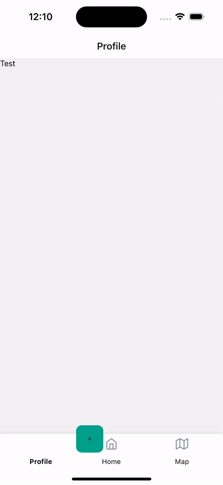

# rn-square-tabbar



Custom animated bottom-tab-bar for react-native.

## 💾 Installation

```
yarn add rn-square-tabbar
```

or

```
npm install rn-square-tabbar
```

## ⚒️ Usage

```jsx
<Tab.Navigator
  tabBar={(props) => {
    return (
      <SquareTabBar
        tabBarStyle={{}} // Styling the whole tab bar
        iconsStyle={{}} // Styling all icons
        selectedIconStyle={{}} // Styling only selected icon
        labelsStyle={{}} // Styling all labels
        selectedLabelStyle={{}} // Styling only selected label
        selectedTabStyle={{}} // Styling the selected tab (the green square)
        {...props} // Required
      ></SquareTabBar>
    );
  }}
>
  <Tab.Screen
    name="Profile"
    component={Test}
    options={{
      tabBarIcon: <Icon name="user" size={22}></Icon>,
    }}
  ></Tab.Screen>
  <Tab.Screen
    name="Home"
    component={SecondScreen}
    options={{
      tabBarIcon: <Icon name="home" size={22}></Icon>,
    }}
  ></Tab.Screen>
  <Tab.Screen
    name="Map"
    component={SecondScreen}
    options={{
      tabBarIcon: <Icon name="map" size={22}></Icon>,
    }}
  ></Tab.Screen>
</Tab.Navigator>
```
